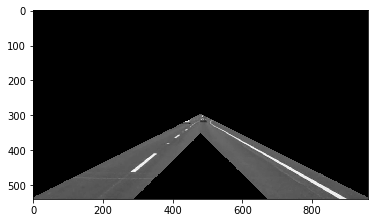
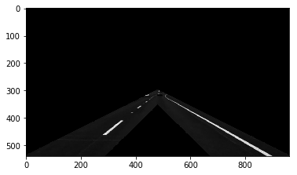
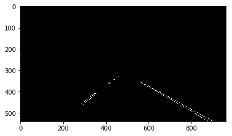
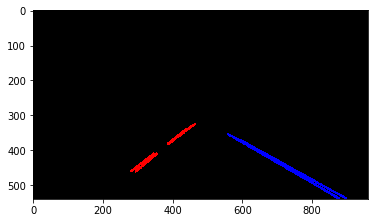
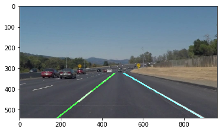

# **Finding Lane Lines on the Road** 

The goals / steps of this project are the following:
* Make a pipeline that finds lane lines on the road
* Reflect on your work in a written report

[//]: # (Image References)

[image1]: ./examples/grayscale.jpg "Grayscale"

---

### Reflection

### 1. Describe your pipeline. As part of the description, explain how you modified the draw_lines() function.

My pipeline consisted of 5 steps.

First, I select an upside down V shaped region of interest which may contain the lane markings.

Second, I adjust the gamma by 0.4 which increases the contrast in the image making it easier for the canny edge detection algorithm to identify the edges. Then I convert to grayscale.

Next, I apply the canny edge detection algorithm. In addition, I select a slightly smaller region of interest to remove all the edges detected on the boundary of the first selection.

The next step uses the Hough transformation to find lines in the image. Before drawing them, I further filter out all detected lines which are too flat (inclination < 0.5). Then I split the list of lines into two - one for the left lane and another one for the right lane; lines in the left part of the image with positive inclination and lines on the right part of the image with negative inclination are discarded.

In the final step, I fit a single first order polynomial for the left and the right lines, respectively. The fit weights which are closer to ego more. Also, samples coming from longer hough lines are weighted more. Further, the coefficients of this polynomial are stabilized using exponential smoothing (alpha=0.3 seems to fit okay for the videos).

### 2. Identify potential shortcomings with your current pipeline

One shortcoming is that my algorithm and the chosen parameters have only been validated using four pictures and three videos which may lead to a great deal of overfitting.

Another obvious shortcoming (especially noticeable in the "challenge video") is that I used a first order polynomial to mark the lane which does not work well in bends.

Yet another shortcoming is that my algorithm is only able to detect the ego lane but no other lanes.

Also, when performing a lane change the algorithm is most likely to break down because of my selected region of interest.

### 3. Suggest possible improvements to your pipeline

A possible improvement would be to use a third (or fifth) order polynomial or even a polygon to better match lanes with curvature. Of course, this would require additional stabilization efforts.

Another potential improvement would be to use motion data from the vehicle like velocity and steering angle to plausiblize the lane estimation and to adapt the stabilization times.

Yet another possible improvement could be to make the assumption that all relevant lines intersect (approximately) in a common vanishing point. Lines with a different vanishing point could be discarded thus making it possible to remove the region of interest assumption opening the possibility to also estimate neighbouring lanes.

Another potential improvement would be to use color selection to only consider lanes which are white and yellowish. Especially in the challenge video the black line shaped shadows create a lot of false positives.